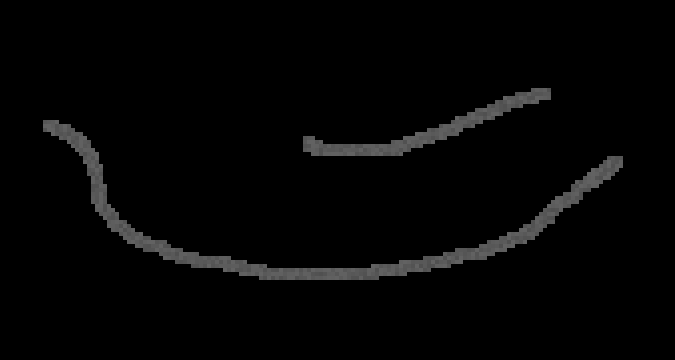

# Sandbox C++ simulation

This is my c++ sanbox simulation made from scratch using only the SFML library for rendering.

Below you will see a list of custom materials and propreties assiociated ith them.

## Materials

| Material | Sand-like | Liquid | Solid (no gravity) | Settable on fire | Can generate heat | Evaporates with heat | Corrodible | Water soluble |
|:-------- |:---------:|:------:|:------------------:|:----------------:|:-----------------:|:--------------------:|:----------:|:-------------:|
| Sand     | ✅         |        |                    |                  |                   |                      | ✅          |               |
| Water    |           | ✅      |                    |                  |                   | ✅                    |            |               |
| Stone    |           |        | ✅                  |                  |                   |                      | ✅          |               |
| Wood     |           |        | ✅                  | ✅                | ✅                 |                      | ✅          |               |
| Salt     | ✅         |        |                    |                  |                   |                      | ✅          | ✅             |
| Oil      |           | ✅      |                    | ✅                | ✅                 |                      | ✅          |               |
| Lava     |           | ✅      |                    |                  | ✅                 |                      |            |               |
| Coal     | ✅         |        |                    | ✅                | ✅                 |                      | ✅          |               |
| Snow     | ✅         |        |                    |                  |                   | ✅                    |            | ✅             |
| Ice      |           |        | ✅                  |                  |                   | ✅                    |            | ✅             |
| Acid     |           | ✅      |                    |                  |                   |                      |            |               |
| Bedrock  |           |        | ✅                  |                  |                   |                      |            |               |

**special elements :**

- air : empty cell without update.

- fire : air with fire set to on, can propagate heat but won't move or evolve.

- steam : generated when water is heated, float up and after a moment cooldown back to water and raindrops.

- salt-water : produced by dissolving salt in water, will generate steam and salt cell when heated.

## Examples

Lava flow and cooldown into stone.

Built water circuit to dissolve salt.

Oil, wood and coal can be set to fire, and propagate heat, water turn into steam.

Acid destroys stone and organic matter.

Snow and ice melt on contact with hot materials such as lava, and turn into water then steam.

## Controls :

| Controls | Sand | Water | Stone | Wood | Salt | Oil | Lava | Coal | Snow | Ice | Acid | Bedrock | fire | air |
| -------- |:----:|:-----:|:-----:|:----:|:----:|:---:|:----:|:----:|:----:|:---:|:----:|:-------:|:----:|:---:|
| Keyboard | S    | W     | T     | O    | L    | I   | V    | Q    | N    | G   | C    | B       | F    | A   |

Space_bar : pause simulation.

Up-arrow : increase speed of simulation.

Down-arrow : decrease speed of simulation.

Back-space : clear all with air.

## External references :

Some external references I'm using to build this project : 

- [John Jackson's video about Noita's sand simulation](https://www.youtube.com/watch?v=VLZjd_Y1gJ8)

- [MARF's video about this kind of simulation using a Cellular Automata](youtube.com/watch?v=5Ka3tbbT-9E)
